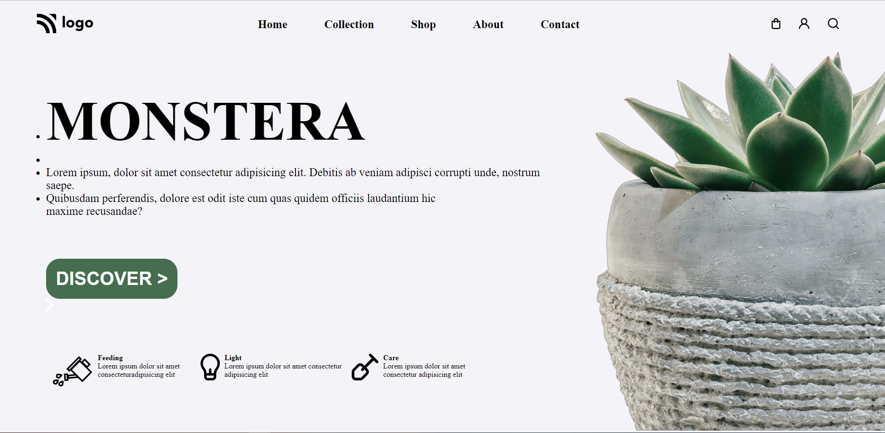

# A decentralised and distributed platform for Freelancing community

## Project Name: Zero Knowledge Freelance Platform 

---

### Project Descripttion

> **In this project, we have created a decentralised freelancing community which enables zero knowledge transparency and authentic business between clients and freelancers. Clients and Freelancers collaborate and communicate through push notification and push Chat Dapp. WorldCoins is used for authentication and check if the user is human or not.  IPFS is used for blockchain storage and eventually the platform is deployed on vialist.**

---

## 🛠 Technologies used

> Ethereum

> Push Protocol for Notification and Chat

> ReactJs 

> IPFS, FileCoin,web3.storage 

> WorldCoin for authentication 
---

---

## Feedback

> For any kind of feedback please contact me on my email: sujalmaiti123456@gmail.com and social links are also provided in my profile, feel free to connect with me.

> please check the below project screenshot and video

## Project Screenshot

> 
